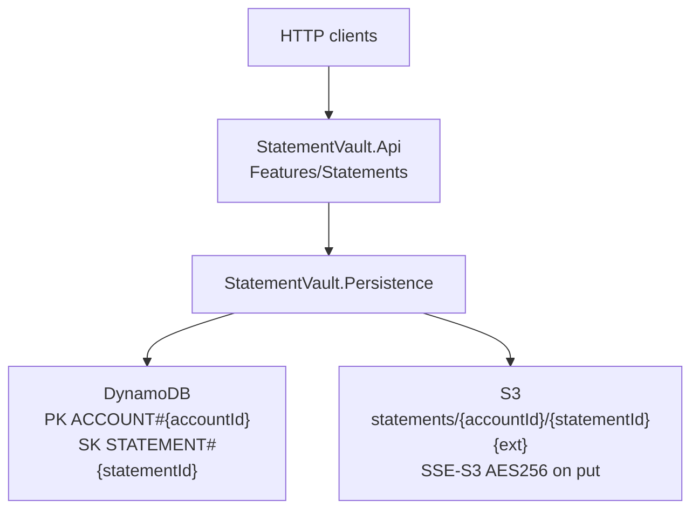
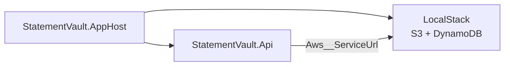
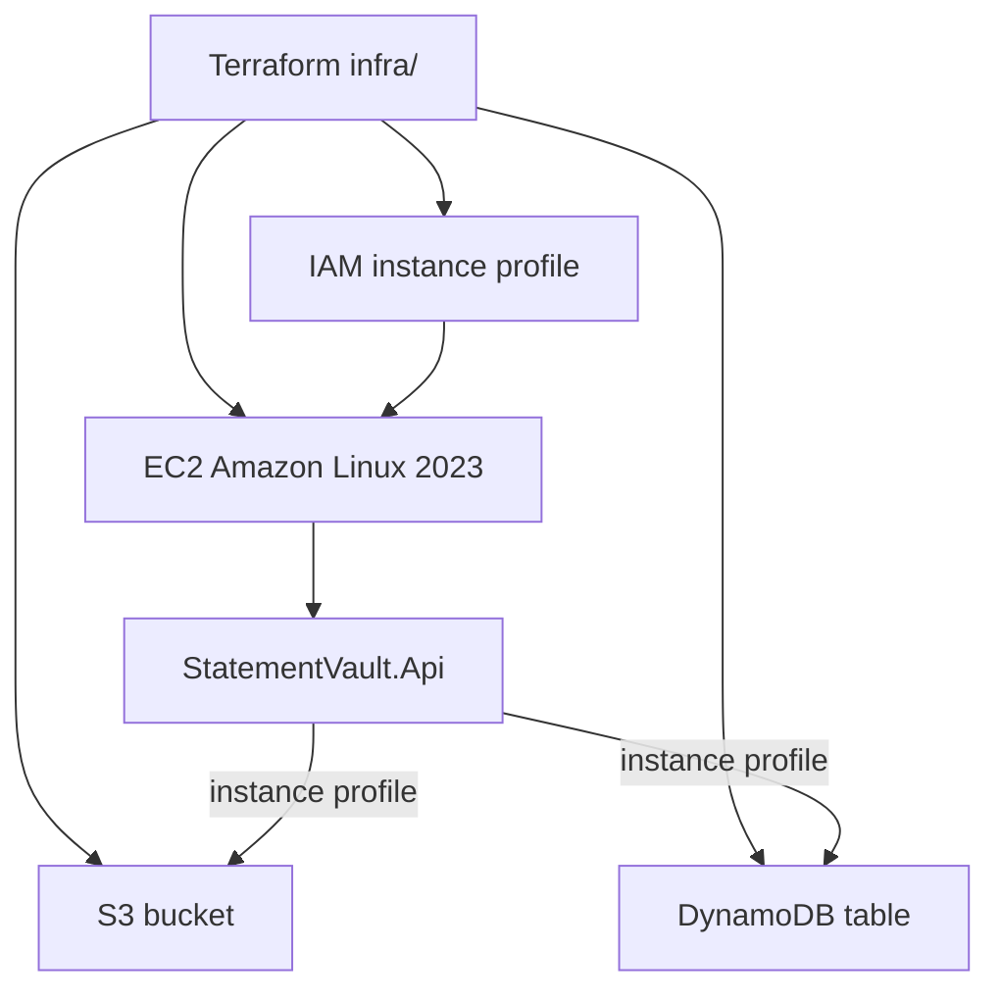

# StatementVault

API-only sample of a bank statement archive: files in **S3**, metadata in **DynamoDB**, hosted on **EC2**, orchestrated locally with **.NET Aspire + LocalStack**.

This is a teaching repo, not a product. The code is deliberately small. A real institution would add OIDC (Cognito or the bank IdP), a WAF, private networking, KMS CMKs, and a deployment pipeline. Those are called out below, not implemented.

## Stack

| Piece | Choice |
| --- | --- |
| Runtime | **.NET 10** (`net10.0`) — same TFM the current Aspire AppHost templates use |
| Aspire | **13.5.4** (`Aspire.AppHost.Sdk`) |
| AWS SDK | **AWSSDK.S3 / AWSSDK.DynamoDBv2 4.x** with `IOptions` and the default credential chain |
| Local AWS | LocalStack 4.8 container from the AppHost (not CDK) |
| IaC | Terraform under `infra/` (S3, DynamoDB, EC2, instance profile) |

Pinned SDK: see `global.json`. Package versions: `Directory.Packages.props`.

## Architecture



Locally, Aspire starts LocalStack and the API. On AWS, Terraform creates the bucket, table, and an Amazon Linux 2023 host with an instance profile. The API talks to regional AWS endpoints and picks up credentials from the instance profile. No access keys are stored in code or Terraform.

### Vertical slices

Use cases live under `src/StatementVault.Api/Features/`, not in a shared controller layer:

| Slice | HTTP |
| --- | --- |
| `UploadStatement` | `POST /api/statements` (multipart metadata + file) |
| `ListStatements` | `GET /api/statements/{accountId}?limit=&nextToken=` |
| `GetStatement` | `GET /api/statements/{accountId}/{statementId}` |
| `DownloadStatement` | `GET /api/statements/{accountId}/{statementId}/content` (`?mode=url` for a presigned GET) |
| Health | `GET /health` |

`StatementVault.Domain` is thin: the `Statement` record, key helpers, and store ports. `StatementVault.Persistence` is the only project that references the AWS SDK.

### DynamoDB item

| Attribute | Notes |
| --- | --- |
| `PK` | `ACCOUNT#{accountId}` |
| `SK` | `STATEMENT#{statementId}` |
| `PeriodStart` / `PeriodEnd` | `yyyy-MM-dd` |
| `ContentType` | From the upload |
| `SizeBytes` | Number |
| `S3Key` | `statements/{accountId}/{statementId}{ext}` |
| `CreatedAtUtc` | ISO-8601 |
| `CorrelationId` | From `X-Correlation-ID` or generated |

List uses `Query` on `PK` + `begins_with(SK, STATEMENT#)`, with `ExclusiveStartKey` encoded as `nextToken`.

## Prerequisites

- .NET SDK 10 (`dotnet --list-sdks`)
- Docker (Aspire + LocalStack)
- Optional: [Aspire CLI](https://get.aspire.dev) for the dashboard. `dotnet build` does not require it (`AspireUseCliBundle` is false so CI/agents without the CLI still compile).
- Optional: Terraform >= 1.6 and an AWS account for `infra/`

## Local run (Aspire + LocalStack)

```bash
dotnet restore StatementVault.slnx
dotnet run --project src/StatementVault.AppHost
```



Aspire starts:

1. A LocalStack container with S3 and DynamoDB.
2. The API, with `Aws__ServiceUrl` pointed at LocalStack and dummy `AWS_ACCESS_KEY_ID=test` / `AWS_SECRET_ACCESS_KEY=test` (LocalStack only; the default chain still applies).

On first request after startup the API creates the local bucket and table when `Aws:CreateResources` is true.

OpenAPI (Development): `GET /openapi/v1.json`.

```bash
curl -s http://localhost:<api-port>/health
curl -s -F accountId=acc-1001 -F periodStart=2026-01-01 -F periodEnd=2026-01-31 \
  -F file=@./jan.pdf \
  http://localhost:<api-port>/api/statements
```

The AppHost HTTP port is shown in the Aspire dashboard. Running the API project alone uses `http://localhost:5080` and expects LocalStack on `http://127.0.0.1:4566`.

### LocalStack vs real AWS

| | Local (Aspire default) | EC2 / real AWS |
| --- | --- | --- |
| `Aws:ServiceUrl` | LocalStack edge URL | empty |
| `Aws:ForcePathStyle` | `true` | `false` |
| `Aws:CreateResources` | `true` | `false` (Terraform owns resources) |
| Credentials | env `test`/`test` for LocalStack | instance profile / default chain |

To point the AppHost at a real account (still no keys in source):

```bash
# Aws:UseLocalStack=false, and your default AWS profile / env creds
dotnet run --project src/StatementVault.AppHost -- --Aws:UseLocalStack=false
```

## Configuration

Section `Aws` (`IOptions<AwsOptions>`):

| Key | Purpose |
| --- | --- |
| `Region` | AWS region and SDK `AuthenticationRegion` |
| `BucketName` | Statement object bucket |
| `TableName` | Metadata table |
| `ServiceUrl` | Optional emulator endpoint |
| `ForcePathStyle` | LocalStack S3 |
| `CreateResources` | Create bucket/table if missing (local only) |
| `PresignedUrlLifetimeMinutes` | `?mode=url` lifetime (clamped 1–60) |

Environment variables use the usual `__` form, e.g. `Aws__BucketName`.

On EC2 the Terraform `user_data` writes `/etc/statementvault.env` with region, bucket, and table. The SDK uses the instance profile. There are no hardcoded secrets.

## Terraform

```bash
cd infra
cp terraform.tfvars.example terraform.tfvars   # set allowed_cidr to your IP
terraform init
terraform fmt
terraform apply
```



Creates:

- Encrypted S3 bucket, public access blocked, bucket-owner-enforced
- DynamoDB table `PAY_PER_REQUEST` with `PK` / `SK`
- Amazon Linux 2023 EC2 instance, encrypted root volume, IMDSv2 required
- Instance profile with **Get/Put object**, **ListBucket**, and **GetItem/PutItem/Query** only
- Security group ingress on `api_port` from `allowed_cidr`

Outputs: `bucket_name`, `table_name`, `instance_public_dns`, `instance_public_ip`, `instance_role_arn`, `api_base_url`.

`user_data` installs Docker. If `api_image` is empty (the default), it writes `/home/ec2-user/STATEMENTVAULT.md` with publish instructions. If you pass an image, it pulls and runs it with the env file. This sample does not build or push an image for you.

```bash
docker build -f src/StatementVault.Api/Dockerfile -t statementvault-api .
# push to ECR, then:
terraform apply -var='api_image=ACCOUNT.dkr.ecr.REGION.amazonaws.com/statementvault-api:tag'
```

Destroy with `terraform destroy`. The bucket must be empty first.

## Tests

```bash
dotnet test StatementVault.slnx
```

`global.json` opts `dotnet test` into Microsoft.Testing.Platform (required for xUnit v3 on the .NET 10 SDK). API tests use `WebApplicationFactory` and in-memory fakes (no LocalStack required). There are also validator and key-convention unit tests.

## Design choices

- **Vertical slices over layers of controllers.** Each use case is a folder with the endpoint (and a validator where it matters).
- **Thin domain.** No aggregates, no domain events. Keys and ports only.
- **Adapters, not a generic AWS wrapper.** One DynamoDB repository, one S3 store.
- **Default credential chain.** `new AmazonS3Client(config)` / `new AmazonDynamoDBClient(config)`. LocalStack dummy keys are injected as environment variables by Aspire, not compiled in.
- **Correlation id middleware** (`X-Correlation-ID`) plus ProblemDetails. Structured logs/OTel via Aspire (`OTEL_EXPORTER_OTLP_ENDPOINT` when the dashboard is up).
- **FluentValidation** on upload. `CancellationToken` on every I/O path.
- **No auth in this sample.** A bank API would sit behind Cognito/OIDC or an internal gateway. Skipping it keeps the AWS/data path readable.
- **No React UI, no NABS Launchpad packages, no CI.** Layout is borrowed from [nabs-templates-vertical-slice-react](https://github.com/Net-Advantage/nabs-templates-vertical-slice-react) (AppHost, Api / Domain / Persistence, central package versions, API tests) and then stripped to API-only.

## Non-goals

Full CI/CD, Cognito/OIDC, React, heavy DDD, multi-region replication, KMS CMKs, VPC endpoints, and WAF. Add those before anything resembling a production bank workload.
